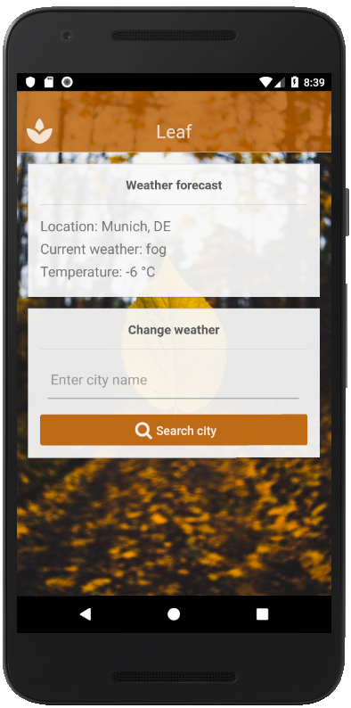

# Leaf
Leaf is a weather app built with React Native and using the OpenWeatherMap API to access current weather data for any location on Earth.

## How to use (Android emulator)
* Start the Android emulator from the AVD Manager in Android Studio.
* Start your terminal, navigate into the project folder and run `react-native run-android`.

Please refer to the React Native documentation for emulation on an iOS or physical device.

## Dependencies
Please be sure your installed the following packages before running this project:
* axios
* react-native-elements
* react-native-vector-icons

## Miscellaneous
Please replace the appid in this project (in file `src\components\Weather.js`) with your own.
Read how to get one [here](https://openweathermap.org/appid).

## Further readings
* [React Native documentation](https://facebook.github.io/react-native/docs/getting-started.html).
* [Axios](https://github.com/axios/axios).
* [React Native Elements](https://react-native-training.github.io/react-native-elements/docs/getting_started.html).